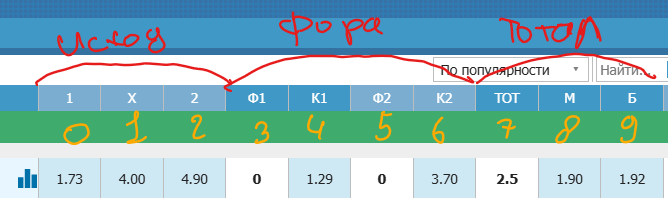
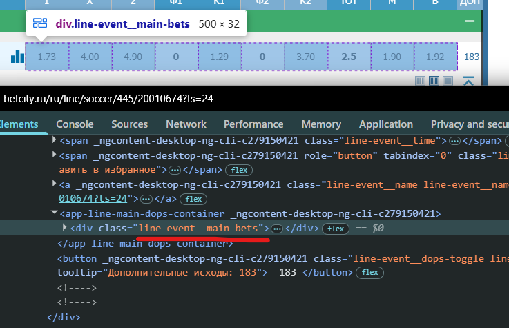
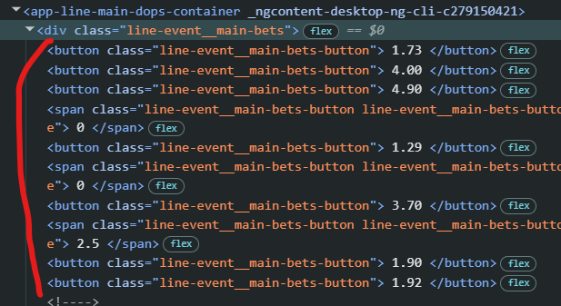
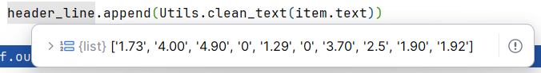
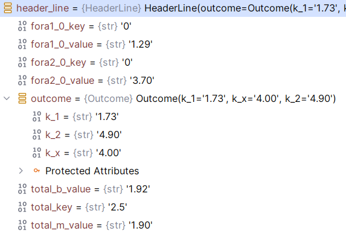

# Заголовок линии
## Откуда берём
Коэффициенты считываются из заголовка линии

Значения считываются в массив от 0 до 9.

Первые три значения [0, 1, 2] - Исходы. Находятся только в заголовке.

## Как берём
Значения находятся в `div` класса `line-event__main-bets`:

Внутри могут быть `button` и `span`. По этому берём всё содержимое `div`:

Из каждого элемента извлекаем текст:

И формализуем в классе `HeaderLine`

