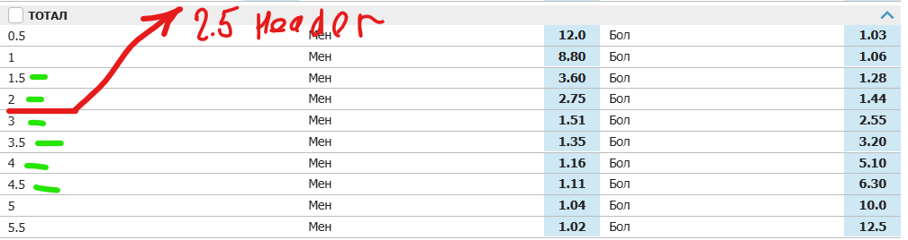
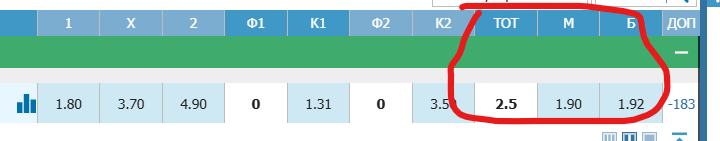

# Тотал
## Откуда берём
Из таблицы ТОТАЛ.
Берём все значения от 1.5 до 4.5 включительно.
Если какое-то значение отсутствует, то бёрем из **Заголовка**. 

## Как берём
- Через метод `ParserUtils.get_rows` получаем список строк таблицы.
- Через метод `ParserUtils.get_mb` для каждой строки получаем значения Мен, Бол. Если каки-то значений нет, то для них возвращается `None`.
- Добавляем / заменяем в `Dto` коэффициент из заголовка.
